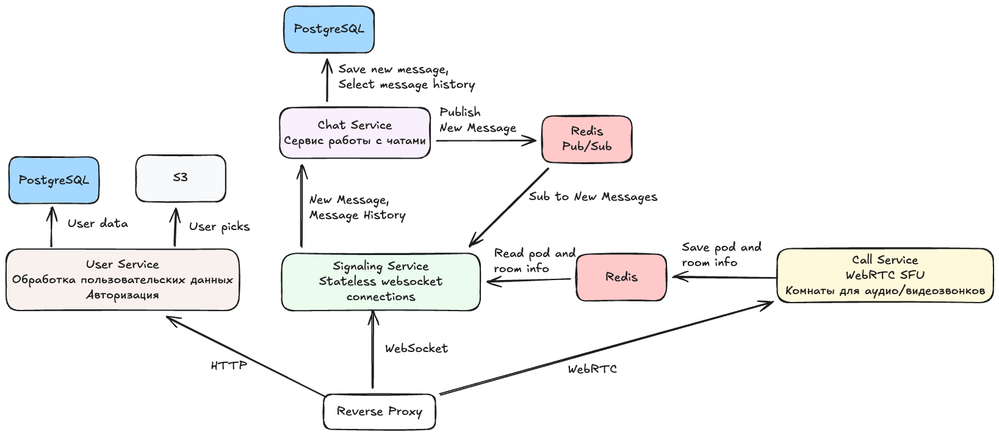

# Chatter - Group chatting app

Документация к проекту расположена в [docs](./docs)

## Архитектура

Микросервисная архитектура
- User Service - сервис для хранения пользовательских данных
- Chat Service - сервис роботы с чатами
- Signaling Service - сервис с websocket соединениями для чатов и сигналинга webrtc
- Call Service - сервис с WebRTC для обработки чатов

## TODO

- [ ] User service
    - [ ] Infra
        - [x] Add PostgreSQL
        - [x] Add S3
        - [ ] Dockerfile
        - [ ] Add to docker-compose.yml
    - [x] Contracts
        - [x] GRPC generation
        - [x] GRPC contracts
        - [x] Migrations
        - [x] Roll up migrations
    - [ ] Service
        - [x] GRPC service
        - [ ] PG adapter
        - [ ] S3 adapter
        - [ ] SignUp handler
        - [ ] LogIn handler
        - [ ] LogOut handler
        - [ ] Update handler
        - [ ] Validate handler
        - [ ] Upload image handler
